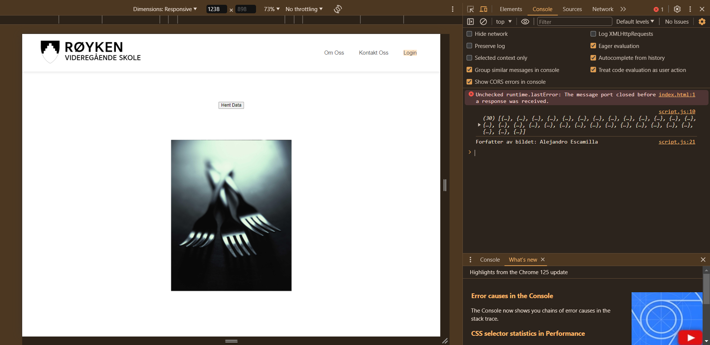

# Prosjektnavn

Dette prosjektet er en enkel demonstrasjon av hvordan du kan bruke JavaScript til å hente data fra et API og vise den i et HTML-dokument.

## Skjermbilde

## Hvordan bruke

1. Last ned eller klon prosjektet til din lokale maskin.
2. Åpne `index.html` i en nettleser.
3. HTML-dokumentet vil hente data fra et API og vise den.

## Dette er fargene jeg brukte

| Farge             | Hex                                                                |
| ----------------- | ------------------------------------------------------------------ |
| Eksempelfarge |  #772F1A |
| Eksempelfarge |  #F58549 |
| Eksempelfarge |  #EEC170 |
| Eksempelfarge |  #F2A65A |

## Viktige ting å tenke på for universell utforming

- **Tilgjengelighet**: Sørg for at alle brukere, inkludert de med nedsatt funksjonsevne, kan få tilgang til og bruke applikasjonen din. Dette inkluderer å sikre at nettstedet er navigerbart med tastatur, har alternative tekstbeskrivelser for bilder, og er kompatibelt med skjermlesere.
- **Fargekontrast**: Pass på at fargekontrasten mellom tekst og bakgrunn er tilstrekkelig for å sikre lesbarhet, spesielt for personer med synsproblemer.
- **Skalering**: Design layouten slik at den enkelt kan skaleres for å passe til ulike skjermstørrelser og enheter, slik at alle brukere kan få en god opplevelse uavhengig av enheten de bruker.
- **Tekststørrelse og skrifttype**: Bruk leselig tekststørrelse og skrifttyper som er enkle å lese for alle, inkludert de med synshemninger.
- **Navigasjon**: Lag en klar og enkel navigasjonsstruktur som gjør det enkelt for brukerne å finne det de leter etter, uavhengig av deres ferdighetsnivå eller teknologiske begrensninger.

## Implementasjon

- `index.html`: Inneholder HTML-strukturen for spillet og kobler til CSS og JavaScript-filer.
- `styles.css`: Definerer utseendet på spillet.
- `index.js`: Inneholder JavaScript-koden for spillets logikk, inkludert behandling av spillervalg, beregning av resultatet og lagring av resultater i Firebase-databasen.
